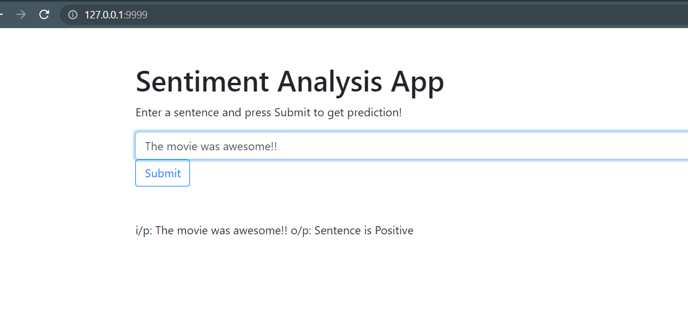

# Assignment 10
Command for docker:  

Build docker image:  
`docker build --tag digit_classifier_app .`

Run the container on port 5000
`docker run -p 5000:5000 digit_classifier_app`


# Pytest Quiz3

```
(py3.6) ada@LAPTOP-U0O9E34L:~/codes/ML-Ops_Scikit/tests$ pytest test_quiz3.py 
=============================================== test session starts ===============================================
platform linux -- Python 3.6.9, pytest-6.2.5, py-1.10.0, pluggy-1.0.0
rootdir: /home/ada/codes/ML-Ops_Scikit/tests
plugins: anyio-3.3.0
collected 20 items                                                                                                

test_quiz3.py ....................                                                                          [100%]

================================================ warnings summary =================================================
test_quiz3.py:47
  /home/ada/codes/ML-Ops_Scikit/tests/test_quiz3.py:47: FutureWarning: Using a non-tuple sequence for multidimensional indexing is deprecated; use `arr[tuple(seq)]` instead of `arr[seq]`. In the future this will be interpreted as an array index, `arr[np.array(seq)]`, which will result either in an error or a different result.
    samples.append(x_test[idx_i][0])

-- Docs: https://docs.pytest.org/en/stable/warnings.html
========================================== 20 passed, 1 warning in 0.77s ==========================================
(py3.6) ada@LAPTOP-U0O9E34L:~/codes/ML-Ops_Scikit/tests$ 
```


# Flask 

**1. Simple sentiment analyzer**   

To run the code, go to the folder and run python main.py




**2. Webpage visit counter**  

To run the code, go to the folder and run python app.py  


<br>

**Model Loading and Prediction using Flask**
```
loading the model...
***model loaded***

 * Debugger is active!
 * Debugger PIN: 101-751-945
image:
 [['0.0' '0.0' '0.0' '2.000000000000008' '12.99999999999999'
  '2.3092638912203262e-14' '0.0' '0.0' '0.0' '0.0' '0.0'
  '7.99999999999998' '14.999999999999988' '2.664535259100375e-14' '0.0'
  '0.0' '0.0' '0.0' '4.9999999999999885' '15.999999999999975'
  '5.000000000000027' '2.0000000000000027' '3.552713678800496e-15' '0.0'
  '0.0' '0.0' '14.999999999999975' '12.000000000000007'
  '1.0000000000000182' '15.999999999999961' '4.000000000000018'
  '7.1054273576009955e-15' '3.5527136788004978e-15' '3.9999999999999925'
  '15.999999999999984' '2.0000000000000275' '8.999999999999984'
  '15.999999999999988' '8.00000000000001' '1.4210854715201997e-14'
  '3.1554436208840472e-30' '3.5527136788004974e-15' '9.999999999999995'
  '13.999999999999986' '15.99999999999999' '16.0' '4.000000000000025'
  '7.105427357601008e-15' '0.0' '0.0' '0.0' '0.0' '12.999999999999982'
  '8.000000000000009' '1.4210854715202004e-14' '0.0' '0.0' '0.0' '0.0'
  '0.0' '12.999999999999982' '6.000000000000012' '1.0658141036401503e-14'
  '0.0']]
prediction: 4
```

```
127.0.0.1 - - [18/Nov/2021 23:45:05] "POST /predict HTTP/1.1" 200 -
image:
 [['0.0' '0.0' '0.0' '11.999999999999982' '13.000000000000004'
  '5.000000000000021' '8.881784197001265e-15' '0.0' '0.0' '0.0' '0.0'
  '10.999999999999986' '15.999999999999988' '9.000000000000005'
  '1.598721155460224e-14' '0.0' '0.0' '0.0' '2.9999999999999925'
  '14.999999999999979' '15.999999999999998' '6.000000000000022'
  '1.0658141036401509e-14' '0.0' '6.217248937900871e-15'
  '6.999999999999987' '14.99999999999998' '15.999999999999996' '16.0'
  '2.0000000000000284' '3.552713678800507e-15' '0.0'
  '5.5220263365470826e-30' '6.21724893790087e-15' '1.0000000000000113'
  '15.99999999999998' '16.0' '3.000000000000022' '5.32907051820075e-15'
  '0.0' '0.0' '0.0' '0.9999999999999989' '15.99999999999998' '16.0'
  '6.000000000000015' '1.0658141036401498e-14' '0.0' '0.0' '0.0'
  '0.9999999999999989' '15.99999999999998' '16.0' '6.000000000000018'
  '1.0658141036401503e-14' '0.0' '0.0' '0.0' '0.0' '10.999999999999986'
  '15.999999999999993' '10.00000000000001' '1.7763568394002505e-14' '0.0']]
prediction: 1
```

# ML-Ops

> To avoid folder name confusion, I have put code in `src` folder.


To run the Classification example follow below instructions:

1. Create a new conda environment  
```conda create --name new_env_name python=3.6```

2. Switch to this environment  
```conda activate new_env_name```

3. To install requirements, use conda. This will ensure that dependencies are resolved correctly.  
```conda install --file requirements.txt```

**Initial Output**

```
================================
Recognizing hand-written digits
================================

This example shows how scikit-learn can be used to recognize images of
hand-written digits, from 0-9.

Classification report for classifier SVC(gamma=0.001):
              precision    recall  f1-score   support

           0       1.00      0.99      0.99        88
           1       0.99      0.97      0.98        91
           2       0.99      0.99      0.99        86
           3       0.98      0.87      0.92        91
           4       0.99      0.96      0.97        92
           5       0.95      0.97      0.96        91
           6       0.99      0.99      0.99        91
           7       0.96      0.99      0.97        89
           8       0.94      1.00      0.97        88
           9       0.93      0.98      0.95        92

    accuracy                           0.97       899
   macro avg       0.97      0.97      0.97       899
weighted avg       0.97      0.97      0.97       899


Confusion matrix:
[[87  0  0  0  1  0  0  0  0  0]
 [ 0 88  1  0  0  0  0  0  1  1]
 [ 0  0 85  1  0  0  0  0  0  0]
 [ 0  0  0 79  0  3  0  4  5  0]
 [ 0  0  0  0 88  0  0  0  0  4]
 [ 0  0  0  0  0 88  1  0  0  2]
 [ 0  1  0  0  0  0 90  0  0  0]
 [ 0  0  0  0  0  1  0 88  0  0]
 [ 0  0  0  0  0  0  0  0 88  0]
 [ 0  0  0  1  0  1  0  0  0 90]]
```

**Results on Rescaling and Resizing Images**

```
image size    train:test       accuracy   precision  recall    f1
  8*8          80:20            0.9583     0.9594    0.9586    0.9578
  8*8          70:30            0.9704     0.9709    0.9704    0.9703
  8*8          60:40            0.9652     0.9656    0.9658    0.9649
  
  7*7          80:20            0.9417     0.9427    0.9416    0.9405
  7*7          70:30            0.95       0.9504    0.9496    0.9495
  7*7          60:40            0.9555     0.9561    0.9557    0.9553
  
  6*6          80:20            0.9306     0.9351    0.9313    0.929
  6*6          70:30            0.9463     0.9473    0.946     0.9456
  6*6          60:40            0.9444     0.946     0.9445    0.944
  
  5*5          80:20            0.9306     0.9325    0.9304    0.9294
  5*5          70:30            0.9241     0.9244    0.9233    0.9231
  5*5          60:40            0.9305     0.9319    0.9302    0.9297  
  
  4*4          80:20            0.8667     0.8707    0.8657    0.8655     
  4*4          70:30            0.8537     0.857     0.8522    0.8496
  4*4          60:40            0.8387     0.8555    0.8392    0.8276
  
  2*2          80:20            0.4944     0.4479    0.489     0.4564
  2*2          70:30            0.4389     0.4196    0.4394    0.3825
  2*2          60:40            0.459      0.372     0.4558    0.3969
```
<!-- 
**Changing hyperparameter and observing results for **
```
gamma     accuracy   precision    recall        f1
0.0005    0.9556      0.9565      0.9555      0.9554
0.001     0.9704      0.9709      0.9704      0.9703
0.005     0.8889      0.9432      0.8885      0.9022
0.01      0.6963      0.9241      0.6971      0.7544
0.05      0.1019      0.1099      0.1038      0.0252
0.1       0.0981      0.0098      0.1         0.0179
``` -->

<br>
<hr>
<br>


**Results on changing gamma hyperparameter and observing results for 70:15:15 split**

> The scores below are in the order: [accuracy, precision, recall, f1]

```
shape of data: (1797, 8, 8)
shape of single image: (8, 8)


gamma: 5e-06
        train scores:   [0.7486, 0.8064, 0.7449, 0.6943]
        test scores:    [0.7037, 0.6482, 0.6929, 0.6485]
        val scores:     [0.7037, 0.6598, 0.7093, 0.6514]

gamma: 0.0001
        train scores:   [0.9857, 0.9859, 0.9856, 0.9856]
        test scores:    [0.9556, 0.9639, 0.955, 0.9546]
        val scores:     [0.9, 0.9108, 0.8998, 0.8977]

gamma: 0.0005
        train scores:   [0.9976, 0.9976, 0.9976, 0.9976]
        test scores:    [0.9852, 0.9858, 0.9849, 0.985]
        val scores:     [0.9259, 0.9314, 0.9259, 0.925]

gamma: 0.001
        train scores:   [0.9992, 0.9992, 0.9992, 0.9992]
        test scores:    [0.9926, 0.993, 0.9926, 0.9926]
        val scores:     [0.9481, 0.9515, 0.9479, 0.9477]

gamma: 0.005
        train scores:   [1.0, 1.0, 1.0, 1.0]
        test scores:    [0.9333, 0.9581, 0.9335, 0.9371]
        val scores:     [0.8444, 0.9306, 0.8445, 0.8639]

gamma: 0.01
        train scores:   [1.0, 1.0, 1.0, 1.0]
        test scores:    [0.7556, 0.9275, 0.7588, 0.7955]
        val scores:     [0.637, 0.9216, 0.6353, 0.7004]

gamma: 0.05
        train scores:   [1.0, 1.0, 1.0, 1.0]
        test scores:    [0.1037, 0.11, 0.1037, 0.0254]
        val scores:     [0.1, 0.1097, 0.1038, 0.025]

gamma: 0.1
        train scores:   [1.0, 1.0, 1.0, 1.0]
        test scores:    [0.1, 0.01, 0.1, 0.0182]
        val scores:     [0.0963, 0.0096, 0.1, 0.0176]


best validation f1 score is 0.9477 for optimal gamma 0.001

Optimal gamma: 0.001
        train scores:   [0.9992, 0.9992, 0.9992, 0.9992]
        test scores:    [0.9926, 0.993, 0.9926, 0.9926]
        val scores:     [0.9481, 0.9515, 0.9479, 0.9477]
```

**Observations**
1. After resizing the images to lower dimensions, the numbers for accuracy, precision, recall and f1 are decreasing. This is due to loss in information.
2. With respect to train-test split, for `8*8`, `7*7` and `6*6`, the numbers are better for `70:30` split. In general, as we decrease training samples, numbers go down.
3. As we increase the gamma values from `5e-06` to `0.1`, the scores increase and then decrease. For gamma = `0.001`, we get the best f1 score. We found the optimal gamma using `70:15:15` train:test:validation split.

<br>
<hr>
<br>


**Saving and Predicting from Best model**

- For `gamma = 0.001` we get better scores and for that gamma we save the model and make predictions on the saved model. 

```
shape of data: (1797, 8, 8)
shape of single image: (8, 8)


data: (1797, 64)

(x, y) shape: (1797, 64) (1797,)
(x_train, y_train) shape: (1257, 64) (1257,)
(x_test, y_test) shape: (270, 64) (270,)
(x_val, y_val) shape: (270, 64) (270,)


gamma: 5e-06
        train scores:   [0.7486, 0.8064, 0.7449, 0.6943]
        val scores:     [0.7037, 0.6598, 0.7093, 0.6514]


gamma: 0.0001
        train scores:   [0.9857, 0.9859, 0.9856, 0.9856]
        val scores:     [0.9, 0.9108, 0.8998, 0.8977]


gamma: 0.0005
        train scores:   [0.9976, 0.9976, 0.9976, 0.9976]
        val scores:     [0.9259, 0.9314, 0.9259, 0.925]


gamma: 0.001
        train scores:   [0.9992, 0.9992, 0.9992, 0.9992]
        val scores:     [0.9481, 0.9515, 0.9479, 0.9477]


gamma: 0.005
        train scores:   [1.0, 1.0, 1.0, 1.0]
        val scores:     [0.8444, 0.9306, 0.8445, 0.8639]


gamma: 0.01
        train scores:   [1.0, 1.0, 1.0, 1.0]
        val scores:     [0.637, 0.9216, 0.6353, 0.7004]

>> skipping for gamma: 0.05 as 0.025 is less than 0.11
>> skipping for gamma: 0.1 as 0.0176 is less than 0.11


Saving the best model...


best validation f1 score is 0.9477 for optimal gamma 0.001
        test scores:    [0.9926, 0.993, 0.9926, 0.9926]


loading the model:
SVC(gamma=0.001)

predicting from loaded model:
        test scores:    [0.9926, 0.993, 0.9926, 0.9926] 
```
<br>
<hr>
<br>


**Pytest Experiment Output**  

```
(py3.6) ada@LAPTOP-U0O9E34L:~/codes/ML-Ops_Scikit/tests$ pytest
=============================== test session starts ===============================
platform linux -- Python 3.6.9, pytest-6.2.5, py-1.10.0, pluggy-1.0.0
rootdir: /home/ada/codes/ML-Ops_Scikit/tests
plugins: anyio-3.3.0
collected 5 items

test_exampes.py ...                                                         [ 60%]
test_model.py ..                                                            [100%] 

================================ 5 passed in 1.09s ================================
(py3.6) ada@LAPTOP-U0O9E34L:~/codes/ML-Ops_Scikit/tests$ 
```

<br/>

**Pytest Split Check**  

```
(py3.6) ada@LAPTOP-U0O9E34L:~/codes/ML-Ops_Scikit/tests$ pytest                                                ============================================= test session starts =============================================
platform linux -- Python 3.6.9, pytest-6.2.5, py-1.10.0, pluggy-1.0.0
rootdir: /home/ada/codes/ML-Ops_Scikit/tests
plugins: anyio-3.3.0
collected 8 items                                                                                             

test_exampes.py ...                                                                                     [ 37%]
test_model.py ..                                                                                        [ 62%]
test_splits.py ...                                                                                      [100%]

============================================== 8 passed in 1.01s ==============================================
```


**Pytest Model Save/Load check**  

```
(py3.6) ada@LAPTOP-U0O9E34L:~/codes/ML-Ops_Scikit/tests$ pytest
===================================== test session starts ======================================
platform linux -- Python 3.6.9, pytest-6.2.5, py-1.10.0, pluggy-1.0.0
rootdir: /home/ada/codes/ML-Ops_Scikit/tests
plugins: anyio-3.3.0
collected 9 items                                                                              

test_exampes.py ...                                                                      [ 33%]
test_model.py ..                                                                         [ 55%]
test_quiz.py ....                                                                        [100%]

====================================== 9 passed in 1.18s =======================================
```

<br>
<hr>
<br>


**Model Comparison**

shape of data: (1797, 8, 8)
shape of single image: (8, 8)


data: (1797, 64)

***tuning gamma parameter for svm classifier***

```
gamma: 5e-06
        train scores:   [0.7144, 0.7426, 0.7069, 0.6614]
        val scores:     [0.6556, 0.6039, 0.6994, 0.6167]


gamma: 0.0001
        train scores:   [0.9801, 0.9801, 0.9799, 0.9798]
        val scores:     [0.9556, 0.958, 0.963, 0.9579]


gamma: 0.0005
        train scores:   [0.996, 0.9959, 0.996, 0.996]
        val scores:     [0.9889, 0.9882, 0.9931, 0.9902]


gamma: 0.001
        train scores:   [1.0, 1.0, 1.0, 1.0]
        val scores:     [0.9889, 0.9882, 0.9931, 0.9902]


gamma: 0.005
        train scores:   [1.0, 1.0, 1.0, 1.0]
        val scores:     [0.9611, 0.9673, 0.9644, 0.9635]


gamma: 0.01
        train scores:   [1.0, 1.0, 1.0, 1.0]
        val scores:     [0.7833, 0.9278, 0.7842, 0.8143]

>> skipping for gamma: 0.05 as 0.0154 is less than 0.11
>> skipping for gamma: 0.1 as 0.0154 is less than 0.11


best validation f1 score is 0.9902 for optimal gamma 0.0005
        train scores:     [0.996, 0.9959, 0.996, 0.996]
        val scores:       [0.9889, 0.9882, 0.9931, 0.9902]
        test scores:    [0.9806, 0.9806, 0.9816, 0.9807]

```

***tuning max_depth parameter for decision tree classifier***

```
depth: 10
        train scores:   [1.0, 1.0, 1.0, 1.0]
        val scores:     [0.8722, 0.8726, 0.8764, 0.8721]


depth: 12
        train scores:   [1.0, 1.0, 1.0, 1.0]
        val scores:     [0.8667, 0.865, 0.8736, 0.8645]


depth: 14
        train scores:   [1.0, 1.0, 1.0, 1.0]
        val scores:     [0.8778, 0.8768, 0.884, 0.8773]


depth: 16
        train scores:   [1.0, 1.0, 1.0, 1.0]
        val scores:     [0.8667, 0.8685, 0.8726, 0.8683]


depth: 18
        train scores:   [1.0, 1.0, 1.0, 1.0]
        val scores:     [0.8722, 0.8703, 0.8774, 0.8699]


depth: 20
        train scores:   [1.0, 1.0, 1.0, 1.0]
        val scores:     [0.8556, 0.8497, 0.8644, 0.852]


best validation f1 score is 0.8773 for depth 14
        train scores:     [1.0, 1.0, 1.0, 1.0]
        val scores:       [0.8778, 0.8768, 0.884, 0.8773]
        test scores:      [0.8472, 0.857, 0.8519, 0.8487]

```

***printing test scores of both classifiers on 5 train(60):test(30):val(10) sets***
> scores are shown as [accuracy, precision, recall, f1] on test set of each split.

```
Sr.No                SVM Scores                   Decision Tree Scores
split 0:     [0.9944 0.994  0.994  0.9939]    [0.846  0.8488 0.8446 0.8437]

split 1:     [0.9889 0.9887 0.9894 0.989 ]    [0.8646 0.8656 0.8673 0.8654]

split 2:     [0.9852 0.9853 0.9846 0.9848]    [0.8071 0.812  0.8081 0.8088]

split 3:     [0.9889 0.9902 0.9888 0.9893]    [0.8367 0.8361 0.8399 0.8351]

split 4:     [0.9814 0.9827 0.9813 0.9818]    [0.8516 0.8506 0.851  0.8484]

mean:        [0.9878 0.9882 0.9876 0.9878]     [0.8412 0.8426 0.8422 0.8403]
std dev:     [0.0043 0.0039 0.0043 0.0041]     [0.0193 0.0179 0.0194 0.0186]
```

**Conclusion**  
1. From the scores, we can see that the SVM classifier performing better than decision tree classsifier on all 4 metrics. 
2. Mean scores of SVM classifier are more than 10 points higher than decision tree, this is beacause we are performing image classification task and dealing with high dimensional vectors. 
3. Also, in terms of standard deviation, SVM classifier has low fluctuations compared to decision tree classifier.
